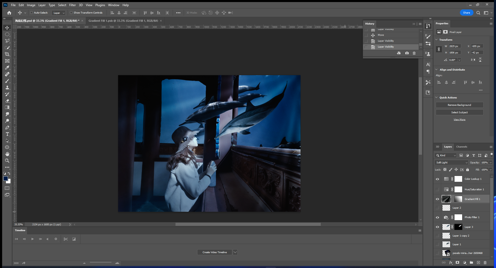

### 丁达尔光线

---

- https://www.bilibili.com/video/BV1PZ4y1D7sC?t=35.4

- 首先用 图层/渐变
  
  - 选择一个光线颜色
  
  - 双击颜色进入渐变编辑器，将颜色模型改为LAB, 将ab两个区域向中间拉，将颜色便简单一点
  
  - 将样式改为角度，调整角度等样式使光线接近预期（或者使用随即样式）
  
  - 再使用高斯模糊，新建图层蒙版，利用黑白渐变来将后半截的光线的若有若无
    
    
