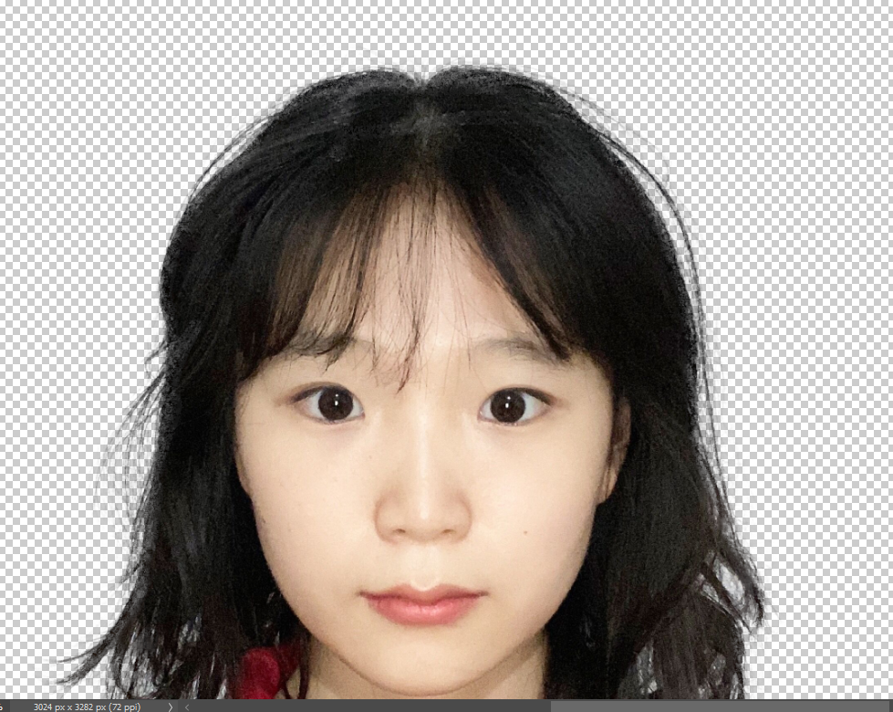

### 抠图技巧

---

- 白边处理
  - https://www.bilibili.com/video/BV12e411u777?t=0.6
- 精细发丝处理
  - https://www.bilibili.com/video/BV1z4411R7VM?t=328.5
    
- 让抠图更真实
  - https://www.bilibili.com/video/BV1Nh411h7tX?t=8.4
  - 主要是考虑：遮挡部分，阴影，光线，比例