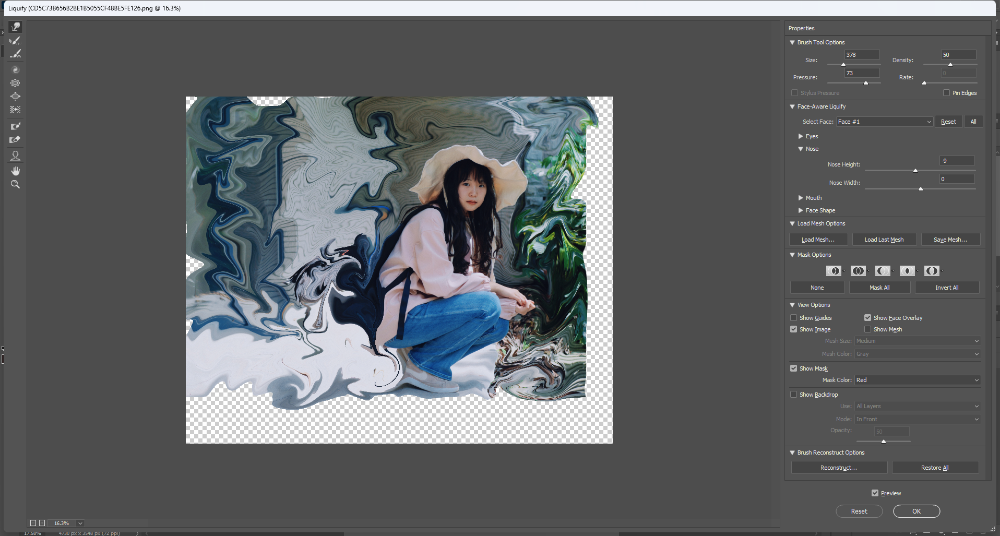
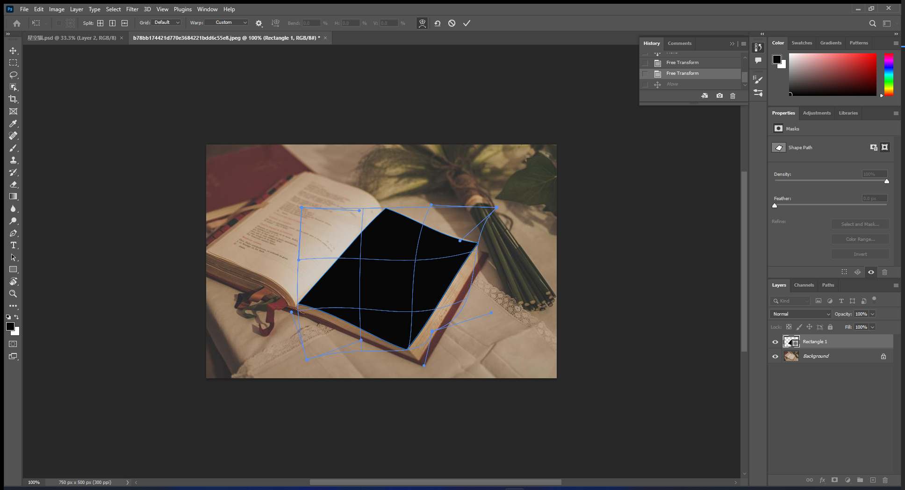

# PS

---

- 快捷键大全调出： ctr+alt+shift+K
- 调整画布大小：alt+滚轮

### 免费可商用素材网站

- 图片类
  
  - https://pixabay.com/
  - https://www.pexels.com/zh-cn/ （氛围感可分类相似查找）

- 免扣png素材
  
  - https://pngimg.com/
  
  - https://www.cleanpng.com/

### 基础概念部分

- 图层
  
  - 图层混合模式改变叠加模式
  - 图层可拖动
  - 可将图层进行隐藏与复制

- 蒙版
  
  - 将图层拖到蒙版按钮，对图层生成蒙版，多用于抠图抹除部分细节，对蒙版进行操作不会损伤原图层。

- 色阶
  
  - 会显示图片色阶值分布直方图，改变值会改变图片色阶分布，通常对人像或者风景图将左边暗部和右边亮部向中间挪动，使得图像更通透。

- 曲线
  
  - 一般使用s型曲线来调光和调色，常用有S型曲线会使得整体画面的对比质感更强

- 钢笔工具对待隔离区域进行区域圈定后，在路径位置进行‘新建为选区’，路径会由蓝色变为浅浅的黑色虚线，这时就可以通过移动工具进行抠图移动等

- 智能图像
  
  - 当对单独图像大小进行缩小再放大时（快捷键：ctrl+T），不会使图像失真，放大后的图像和原图一致
  - 智能图像模式对涂层的操作时可修复的

- 栅格化
  
  - 将图像转为位图模式，缩小放大后图像会失真（像素不会恢复）
  - 栅格化图像后对图像的操作不可逆，会永久的改变图像

- 智能图像和栅格化图像可相互转换（智能对象图层会有个标记，右键图层convert）

- 液化工具与其中的自由变换工具 滤镜/液化工具/第一个按钮与第五六个工具
  
  
  - 一般使用液化工具对人像进行修容，例如修脸型眼睛等，可以改变拖拽部分的轮廓

- 前景色
  
  - 工具的默认颜色是取前景色

- 常见存储格式
  
  - png: 一些抠出的对象可以以此格式存储，透明部分不填充
  - psd文件：会保存对图像处理工作路径

- 自由变换工具
  
  - 放大缩小：默认，无需其他快捷键
  - shift，alt, control键按住后都会使得变换方法不同（也可右键选择）

- ctr+T再右键多边形后点击wrap, 可以使得多边形有弯曲路径的锚点出现，调整操纵杆能达到多边形契合对象的操作
  

- 抠图方式
	- 对规矩的单一对象进行抠图：左边的选框工具栏第二个，根据对象选择合适的工具
    - 对比较平整的图像使用魔术磁性套索工具（左边第三个），可以再选择选区的时候自动进行边缘识别
    - 魔棒工具：选择某一种颜色可以将图像中此颜色区域进行框选，也可以调整取值颜色和像素误差值。
