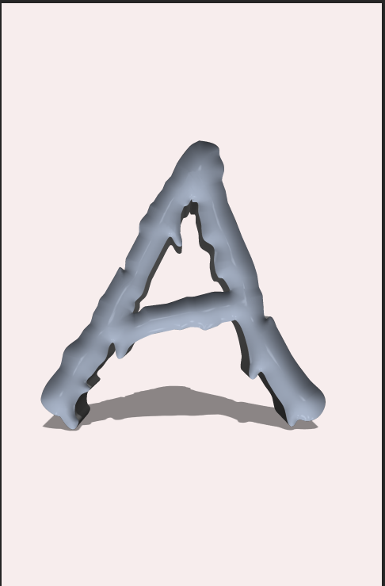

### 效果展示及对应方法集

- PS基础知识：PS.md

- 水果切割海报：fruit_juice.md
  
  

- 3D熔岩字母：3D_metal_melt_laser.md
  
  

- 文字穿插效果：text_accroess_picture.md
     

- 霓虹灯光：treat_light.md
  
  

- 抠图技巧及要素：Matting_skill.md

- 文字光圈：treat_light
  
  

- 幻想发光效果：butterfly_me
  
  

- 齿轮与燃烧的linux
  
  

- 超现实空间蒙版: space_reality.md
  
  
