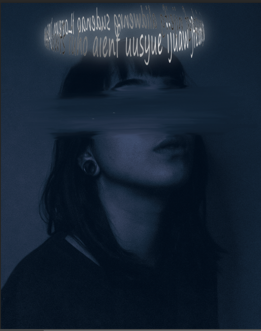

### 模拟霓虹灯光

---

- https://www.bilibili.com/video/BV1zX4y1w7JB?t=153.5

- 思想：通过钢笔勾勒出灯管形状，再通过新建图层填充选区

- 对新建的选区进行内发光外发光等的设置，通过层层叠加模拟均匀的发光效果（参数自调）

- 再新建图层用画笔工具对背景做一些灯光类的修改

- 效果：
  

---

> 这里踩了坑：当图层为智能对象时不能进行选区新建图层，需进行栅格化处理

#### 制作文字光圈

- https://www.bilibili.com/video/BV1fa411S7m3?t=387.7
- 核心思路
  - 首先单独建一个宽且矮的画布，作为文字体，保存为psd文件
  - 再新建画布，从当前图层新建3D区域，并选择初始模型维为球体
  - 将球体的透明度属性降为0，且贴图选择已经保存的文字文件
  - 剩下的便是调整角度大小以及光效了
- 效果
      
